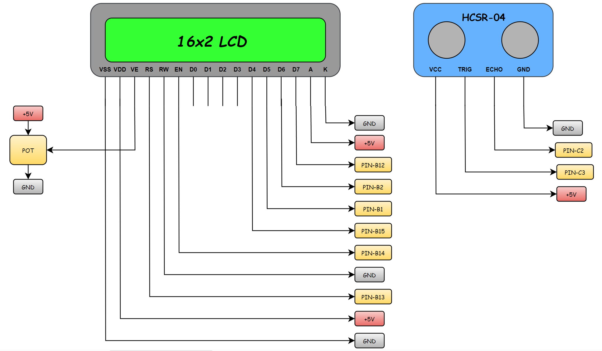
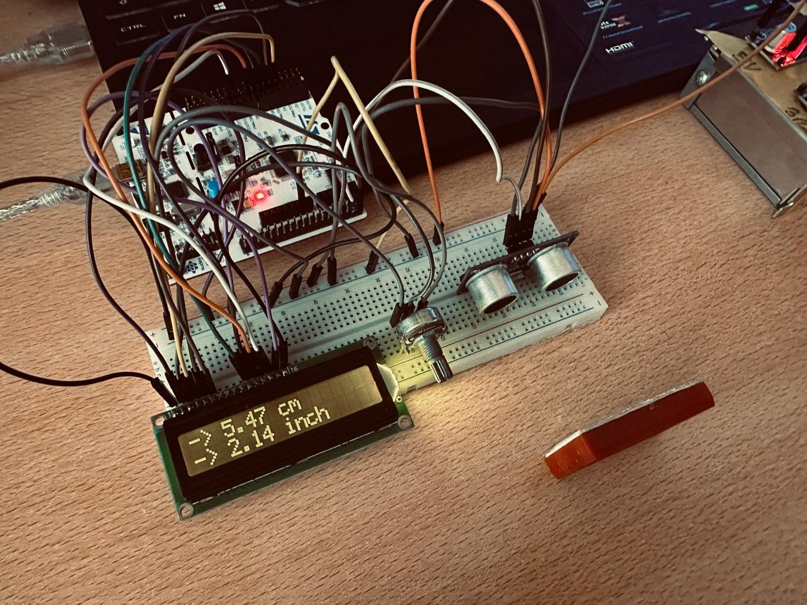

# Driver Development of HCSR-04 Ultrasonic Sensor on STM32 

# ⚡ What is HCSR-04 Ultrasonic Sensors?

The HC-SR04 Ultrasonic Sensor is an electronic distance measurement device that uses high-frequency sound waves to detect objects. It works by emitting ultrasonic pulses and measuring the time it takes for the echo to return. This principle enables accurate and reliable distance measurement in a wide range of applications.

# 🔥 How to Use HCSR-04 Ultrasonic Sensor with Microcontrollers?

Using the HC-SR04 ultrasonic sensor with a microcontroller involves connecting the TRIG and ECHO pins to the microcontroller’s GPIO pins, then programming the microcontroller to send a trigger pulse and measure the echo response. 

Typically, you generate a short pulse on the TRIG pin, capture the duration of the ECHO signal, and process this timing to calculate the distance. This allows the microcontroller to measure and display object distances in units such as centimeters or inches for various applications

# 🛠️ Electrical Diagram

- **VCC (Pin 1)**  

Power supply pin, typically connected to +5V.

- **TRIG (Pin 2)**  

Trigger input pin. A short HIGH pulse (usually 10 µs) is sent to start the measurement.

- **ECHO (Pin 3)**  

Echo output pin. It goes HIGH for a duration proportional to the distance of the object.

- **GND (Pin 4)**  

Ground connection (GND). It serves as the reference voltage for the circuit.

In this application, the STM32 Nucleo F446RE development board was used. You can refer to the above wiring diagram.

# 🚀 Code Explanation

<pre><code class="language-c">void HCSR04_init(volatile GPIO_TypeDef* TRIG_GPIO, volatile uint16_t TRIG_PIN,
				 	       volatile GPIO_TypeDef* ECHO_GPIO, volatile uint16_t ECHO_PIN);
</code></pre>

Initializes the HC-SR04 sensor by configuring the TRIG and ECHO pins for STM32. Sets default values for internal variables used in distance measurement.

<pre><code class="language-c">SensorState_t HCSR04_readSensor(void);
</code></pre>

Triggers the HC-SR04 sensor, measures the echo pulse duration, and updates internal variables.

<pre><code class="language-c">float HCSR04_getDistance_cm(SensorState_t readingState);
</code></pre>

Converts the measured echo duration to distance in centimeters.

<pre><code class="language-c">float HCSR04_getDistance_inch(SensorState_t readingState);
</code></pre>

Converts the measured echo duration to distance in inches.

# 🖥️ Test Highlights

You can easily test the LCD using the following code snippet

<pre><code class="language-c">sensorState = HCSR04_readSensor();
distance_cm = HCSR04_getDistance_cm(sensorState);
distance_inch = HCSR04_getDistance_inch(sensorState);
DELAY_MS(1);

sprintf(bufferDistance_cm, "-> %.2f cm", distance_cm);
sprintf(bufferDistance_inch, "-> %.2f inch", distance_inch);

LCD_clear();
LCD_setCursor(1, 1);
LCD_writeString(bufferDistance_cm);
DELAY_MS(1);
LCD_setCursor(2, 1);
LCD_writeString(bufferDistance_inch);
DELAY_MS(250);
</code></pre>

## 🎉 Thank You for Reviewing!

Thank you for taking the time to check out this project.

Feel free to follow me on these platforms for more updates and projects.

- YouTube: @mnane34

- LinkedIn: Mertcan Nane